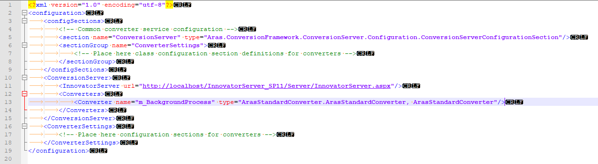
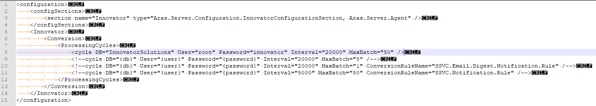
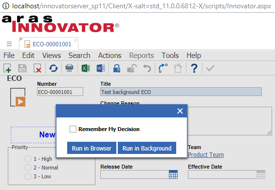
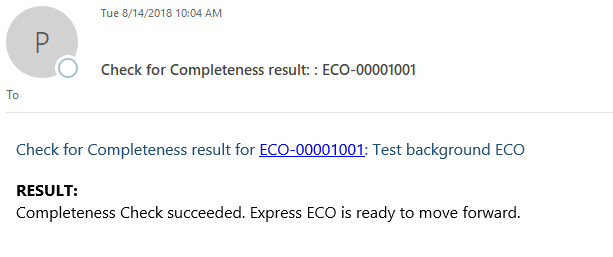

# ArasStandardConverter

### About

The ArasStandardConverter is a framework that allows users to process long-running tasks in the background.

Use cases might be a Check for Completeness for an ECO with hundreds of affected items, promoting a large ECO, long-running reports, or anything else that takes a long time and requires no user interaction.

It uses the Conversion Server and the AgentService to asynchronously run actions and Methods in Aras as the current logged-in user.

Included in this repository are

* The framework
* One example of how it can be used: the ECO's Check for Completeness.

### Installation

### Supported versions of Aras

* 11.0 SP11.
* This can be extended to other versions of Aras as long as they are higher than 11.0 SP5.*

### Pre-requisites:
Installed ConversionServer, AgentService

### Steps
Copy the files from `ConversionServer/bin/` to your Aras installation’s `ConversionServer/bin/` directory, replacing any existing files

Open file `ConversionServerConfig.xml`

Under the `/configuration/ConversionServer/Converters` node, add the following converter:

`<Converter name="m_BackgroundProcess" type="ArasStandardConverter.ArasStandardConverter, ArasStandardConverter" />`

Ensure that the InnovatorServer URL is correct in this file.

File should end up looking something like the following:

Open the file `AgentService/conversion.config`

Under the `/configuration/Innovator/Conversion/ProcessingCycles/` node, add the following line

`<cycle DB="" User="root" Password="" Interval="20000" MaxBatch="50" />`

Fill in the database and root password.

File should end up looking like the following

Restart the AgentService.

Import the packages under Imports/imports.mf:

* TargetRelease = 11.0
* Description = ArasStandardConverter
* Type = Merge
* Mode = Thorough Mode
* All packages selected

Ensure that the Innovator Admin user has a valid email address. This is configured to be the user who sends the email.

### Check for Completeness

### How to test and see the functionality working for yourself

* Login to Aras as a user who can create ECOs.
* Create a new ECO. Fill in required properties, save.
* Use Actions -> Check for Completeness. You should see a dialog with the options to run in the browser, or run in the background.

* If you select Run in Browser, it should work as before: you should see the results in a dialog window.
* If you select Run in Background, you should see a notification alert in the bottom-left of your screen telling you that you will receive the results by email.
* Depending on your email setup in Aras, you should either receive an email or it should be redirected to a file.
* If you are redirecting emails to files, the file should be sent to Innovator/Server/temp/
* The email should contain the results of the Check for Completeness, the same result as if you ran it in the browser.
* If you tick the box to remember your selection, subsequent Check for Completeness runs will use your preferences.

Example of email result

### Extending the capability

To use the background processing in other places than the Check for Completeness:

Run the `m_CreateConversionTask` Method with the proper parameters

* Mandatory param `userData`: The XML (or text) that will be loaded into the background task and applied.
* Mandatory param `methodApplication`: 
	* case `apply`: Apply the XML in the `userData` directly.
	* case `applyMethod`: Runs an applyMethod with the XML (or text) in the `userData` as the `<body>` of the Method.
* Mandatory param `actionToRun`: The action or Method that will be run.
* Optional param `identityToNotify`: This is the user or group to notify. Typically the Alias Identity of the current user. *NOTE* There may be an access issue if you assign this to another Identity other than the current user.
* Optional param `successEmailBody`: In case of success, what is the body of the email to be sent.
* Optional param `emailSubject`: What is the email subject, irrespective of success or failure.
* Optional param `emailHeader`: Any styling / formatting / opening HTML tags to be used in your email.
* Optional param `emailFooter`: Any styling / formatting / closing HTML tags to be used in your email.
* Optional boolean param `failConversionTaskWhenMethodFails`: If the method fails, do you want to fail the ConversionTask? Defaults to `0` or No
* Optional boolean param `sendResultAsEmailBody`: If the ConversionTask returns a Result item, do you want to send the result text in the email? Defaults to `0` or No

### Extending to other service packs

This project is compiled against the ConversionServer DLLs in Aras 11.0 SP11. 

To use against other versions of Aras*, follow these instructions:

* From your current installation of Aras, copy the following files to the repo's ConversionServer/bin/ directory.
	* ConversionServer/bin/Conversion.Base.dll
	* ConversionServer/bin/Conversion.Base.pdb
	* ConversionServer/bin/ConversionManager.dll
	* ConversionServer/bin/ConversionManager.pdb
	* ConversionServer/bin/IOM.dll
	* ConversionServer/bin/IOM.pdb
* Open up the included .sln file from ArasStandardConverter/ArasStandardConverter.sln in Visual Studio (requires at least VS 2015)
* Rebuild the solution.
* Take the generated files from the ConversionServer/bin/ directory, and copy them to your current installation of Aras
	* ConversionServer/bin/ArasStandardConverter.dll
	* ConversionServer/bin/ArasStandardConverter.pdb

### \* Notes 

This project requires at least Aras 11.0 SP5 because SP5 introduced the AgentService and the Conversion Server method `InvokeStandardConverterAsCreator`. This allows the background processing to use the identity membership of the currently-logged-in user, rather than a system or service account. This is important when a user may not have permissions against certain items and we need to ensure that we do not expose any secret information to users who should not see it.